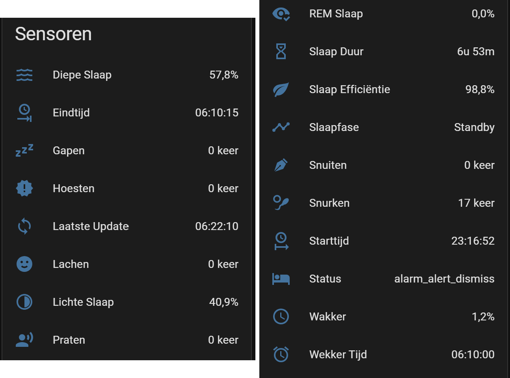
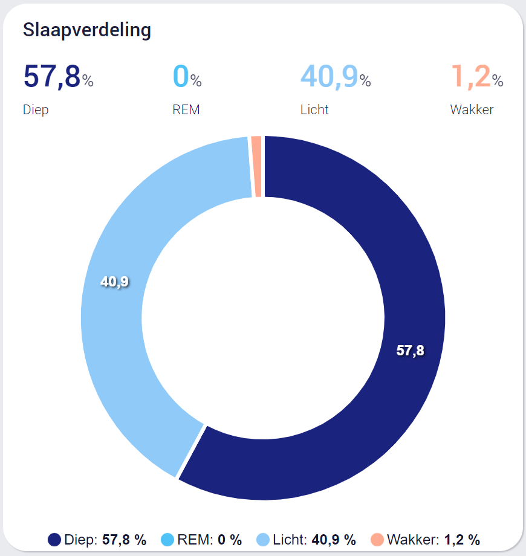

# 🌙 Custom SleepAsAndroid MQTT Sensors for Home Assistant

[](https://github.com/hacs/integration)
[](https://github.com/Roeli1996)
[](https://github.com/Roeli1996/ha-sleep-mqtt/releases)
[](LICENSE)

This custom integration brings advanced sleep tracking analytics from the **SleepAsAndroid** app directly into Home Assistant via MQTT. It features live statistics calculation, a **Real-time Hypnogram**, and full support for Long-Term Statistics.

---

## 📊 Visualisation Examples

### Sleep Analytics Dashboard
The integration provides a comprehensive set of sensors to monitor your rest. Below is an example of how the sensors and the sleep distribution look in a Home Assistant dashboard.

<p align="center">
  
  
</p>

* **Left:** Overview of the numerical and time-based sensors provided by the integration.
* **Right:** A dynamic Donut Chart showing the balance between Deep, Light, REM, and Awake stages.

---

## ✨ Features

* **📊 Live Hypnogram (Numerical):** `Sleep Phase` sensor using integers (1-4) for instant compatibility with **ApexCharts**.
* **💤 Fell Asleep Tracking:** Records the exact timestamp when you actually transition from "Awake" into sleep.
* **🔄 Precise Calculations:** Real-time sleep duration and phase percentages using decimal values for accurate graphing.
* **📈 Long-term Statistics:** Full support for HA Long-Term Statistics (LTS) with `measurement` state classes.
* **🔊 Sound Event Counters:** Tracks snoring, talking, coughing, laughing, and yawning.
* **⏰ Smart Start & Pause:** Correctly handles "Delayed Start" and "Paused" states to ensure your tracking starts the moment you hit the bed.
* **🌍 Official Translations:** Native support for English and Dutch via Home Assistant translation files.

---

## 🚀 Installation

### Step 1: Via HACS (Recommended)
1.  Open **HACS** > Click the three dots (top right) > **Custom repositories**.
2.  Paste: `https://github.com/Roeli1996/ha-sleep-mqtt`
3.  Select **Integration** as the category and click **Add**.
4.  Search for **SleepAsAndroid MQTT Custom** and download.
5.  **Restart** Home Assistant.

### Step 2: Configure SleepAsAndroid App
1.  Open the app on your Android device.
2.  Go to **Settings > Services > MQTT**.
3.  **Enable MQTT** and set your Host/IP (your Home Assistant MQTT broker).
4.  **Topic prefix:** e.g., `SleepAsAndroid/Arne`.
5.  **Important:** Ensure **Events** is checked in the MQTT settings to enable real-time updates.

---

## 💡 Dashboard Tip: Donut Chart
To recreate the donut chart shown above, install **ApexCharts** via HACS and use this configuration (replace `arne` with your device name):

```yaml
type: custom:apexcharts-card
header:
  show: true
  title: Slaapverdeling
  show_states: true
  colorize_states: true
chart_type: donut
series:
  - entity: sensor.arne_slaap_diepe_slaap
    name: Diep
    color: "#1A237E"
  - entity: sensor.arne_slaap_rem_slaap
    name: REM
    color: "#4FC3F7"
  - entity: sensor.arne_slaap_lichte_slaap
    name: Licht
    color: "#90CAF9"
  - entity: sensor.arne_slaap_wakker
    name: Wakker
    color: "#FFAB91"

```

## Changelog
### [1.2.0] - 2026-02-14
#### Added
- **Official Translation Framework:** Full implementation of `strings.json` and `translations/` folder for EN/NL support.
- **Fell Asleep Sensor:** New dedicated sensor capturing the exact timestamp of the first sleep stage.
- **Long-Term Statistics:** Added `state_class: measurement` to enable native HA history analysis.

#### Changed
- **Numerical-First Architecture:** (Breaking Change) Sensors now return numerical values (integers/floats) for native graphing and recorder support.
- **Smart Pause Handling:** Improved session initialization when using delayed starts (`sleep_tracking_paused`).
- **Auto-Recovery:** The tracker now auto-starts if a phase event is received but a start event was missed.

### [1.1.0] - 2026-02-10
- Initial support for multiple devices.
- Added sound event tracking for snoring and coughing.

### [1.0.0] - 2026-01-15
- Initial release with basic MQTT sleep tracking.
