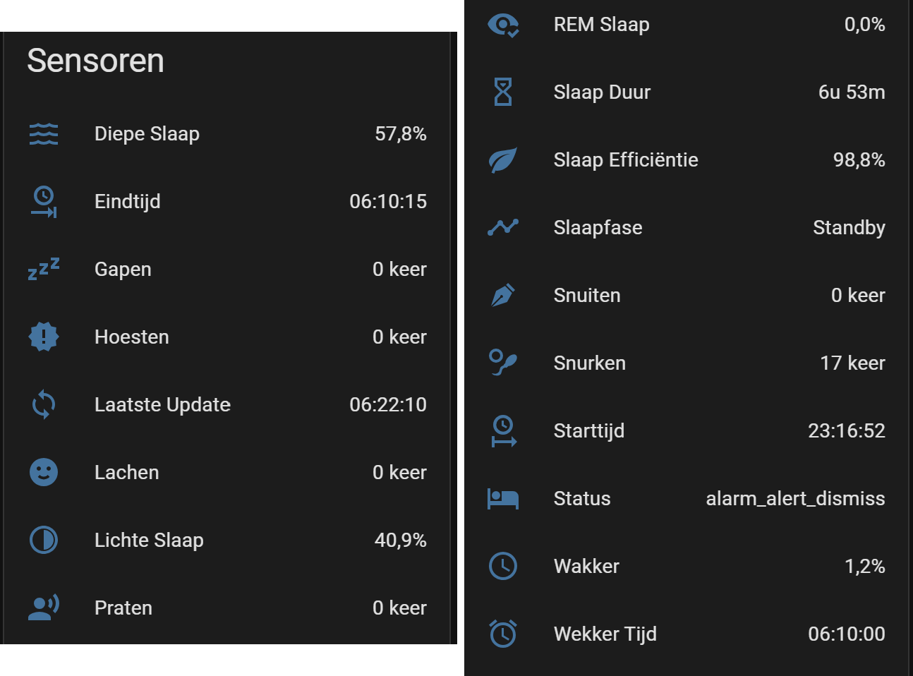
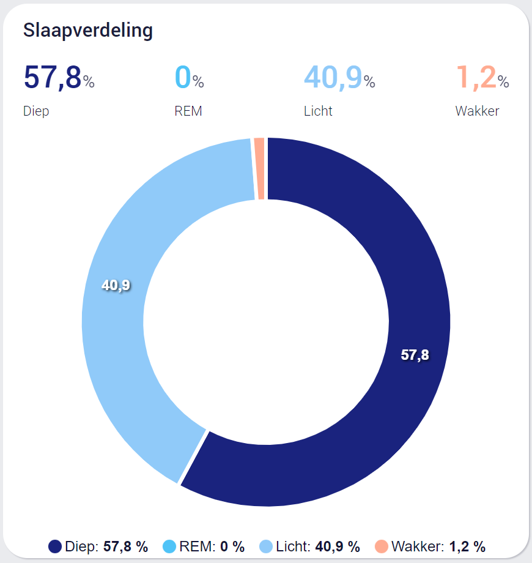

# 🌙 Custom SleepAsAndroid MQTT Sensors for Home Assistant

[](https://github.com/hacs/integration)
[](https://github.com/Roeli1996)
[](https://github.com/Roeli1996/ha-sleep-mqtt/releases)
[](LICENSE)

This custom integration brings advanced sleep tracking analytics from the **SleepAsAndroid** app directly into Home Assistant via MQTT. It features live statistics calculation, a **Real-time Hypnogram**, and full support for Long-Term Statistics.

---

## 📊 Visualisation Examples

### Sleep Analytics Dashboard
The integration provides a comprehensive set of sensors to monitor your rest. Below is an example of how the sensors and the sleep distribution look in a Home Assistant dashboard.

<p align="center">
  
  
</p>

* **Left:** Overview of the numerical and time-based sensors provided by the integration.
* **Right:** A dynamic Donut Chart showing the balance between Deep, Light, REM, and Awake stages.

---

## ✨ Features

* **Real-time Tracking:** Calculates sleep phases (Light, Deep, REM, Awake) and durations second-by-second.
* **Self-Calculated Efficiency:** Local calculation of sleep efficiency based on actual sleep time vs. total time in bed.
* **Multi-User Support:** Easily add multiple devices/users with unique MQTT topics and custom names.
* **Sound Event Counters:** Tracks snoring, talking, coughing, laughing, and shouting with a "last seen" timestamp for each.
* **Smart Status:** The Sleep Phase sensor automatically switches to "Uitgeschakeld" (Disabled) when tracking stops.
* **Alarm Integration:** Captures the exact timestamp of your last alarm event.
* **Fully Local:** All calculations happen on your Home Assistant instance via MQTT.

---

## Sensors Included

### Sleep Tracking & Phases
| Entity | Description |
| :--- | :--- |
| **Sleep Phase** | The current state of sleep (Light Sleep, Deep Sleep, REM, Awake). Shows "Uitgeschakeld" (Disabled) when not tracking. |
| **Sleep Efficiency** | Real-time percentage of actual sleep vs. total time in bed. |
| **Total Sleep Duration** | Cumulative minutes spent in Light, Deep, and REM sleep combined. |

### Phase Durations (Minutes)
| Entity | Description |
| :--- | :--- |
| **Light Sleep Duration** | Total minutes spent in the Light Sleep phase tonight. |
| **Deep Sleep Duration** | Total minutes spent in the Deep Sleep phase tonight. |
| **REM Sleep Duration** | Total minutes spent in the REM Sleep phase tonight. |
| **Awake Duration** | Total minutes spent awake during the tracking session. |

### Timestamps
| Entity | Description |
| :--- | :--- |
| **Start Time** | Exact time when the "Start Tracking" button was pressed. |
| **Fell Asleep** | The timestamp of the first detected sleep phase (Non-Awake). |
| **End Time** | Exact time when tracking was stopped. |
| **Alarm Time** | The timestamp of the last triggered alarm event. |

### Sound & Event Counters
| Entity | Description |
| :--- | :--- |
| **Snoring Count** | Number of times snoring was detected. Includes `last_seen` attribute. |
| **Talking Count** | Number of times talking was detected. Includes `last_seen` attribute. |
| **Coughing Count** | Number of times coughing was detected. Includes `last_seen` attribute. |
| **Laughing Count** | Number of times laughing was detected. Includes `last_seen` attribute. |
| **Shouting Count** | Number of times shouting was detected. Includes `last_seen` attribute. |

### Debugging
| Entity | Description |
| :--- | :--- |
| **Last MQTT Message** | Displays the raw JSON payload of the last received MQTT message. |

## Data Attributes
In version 1.4.0, all **Duration** sensors include an extra attribute:
- **`percentage_of_total`**: This calculates on-the-fly what percentage of your total sleep was spent in that specific phase or doing that specific activity (snoring/talking). This is perfect for custom Gauge cards in your dashboard.

---

## 🚀 Installation

### Step 1: Via HACS (Recommended)
1. Open **HACS** > Click the three dots (top right) > **Custom repositories**.
2. Paste: `https://github.com/Roeli1996/ha-sleep-mqtt`
3. Select **Integration** as the category and click **Add**.
4. Search for **SleepAsAndroid MQTT Custom** and download.
5. **Restart** Home Assistant.

### Step 2: Configure SleepAsAndroid App
1. Open the app on your Android device.
2. Go to **Settings > Services > MQTT**.
3. **Enable MQTT** and set your Host/IP (your Home Assistant MQTT broker).
4. **Topic prefix:** e.g., `SleepAsAndroid/Arne`.
5. **Important:** Ensure **Events** is checked in the MQTT settings to enable real-time updates.

## How it works
The integration listens for MQTT events. When a phase event occurs:
1.  It calculates the time elapsed since the *previous* event.
2.  It adds those minutes to the previous phase's sensor.
3.  It updates the **Total Sleep Duration** (excluding 'Awake' time).
4.  It recalculates the **Efficiency %**.
5.  Upon a `stop_tracking` event, it stops all timers and sets the main phase to **Uitgeschakeld**.

---

## 💡 Dashboard Tip: Donut Chart
To recreate the donut chart shown above, install **ApexCharts** via HACS and use this configuration (replace `arne` with your device name):

```yaml
type: custom:apexcharts-card
header:
  show: true
  title: Sleep Distribution
  show_states: true
  colorize_states: true
chart_type: donut
series:
  - entity: sensor.arne_sleep_deep_sleep
    name: Deep
    color: "#1A237E"
  - entity: sensor.arne_sleep_rem_sleep
    name: REM
    color: "#4FC3F7"
  - entity: sensor.arne_sleep_light_sleep
    name: Light
    color: "#90CAF9"
  - entity: sensor.arne_sleep_awake
    name: Awake
    color: "#FFAB91"
```

---

# Changelog

All notable changes to the **SleepAsAndroid MQTT Custom** integration will be documented in this file.

## [1.4.0] - 2026-02-16
### Added
- **Stopwatch Engine:** Complete rewrite of the duration logic. Phases are now timed locally in Home Assistant for 100% real-time accuracy.
- **Enhanced Sound Tracking:** Added dedicated counters for **Coughing**, **Laughing**, and **Shouting** in addition to Snoring and Talking.
- **Event Metadata:** Sound sensors now include a `last_seen` attribute with the exact timestamp of the event.
- **Automated "Disabled" State:** The main Sleep Phase sensor now automatically switches to "Uitgeschakeld" (Disabled) when tracking stops to clean up the dashboard.
- **Smart Reset:** All duration and event sensors now automatically reset to zero the moment a new `start_tracking` event is received.
- **Full Translation Support:** Added comprehensive `translation_key` support for all 17 sensors in both English and Dutch.

### Changed
- **Local Efficiency Calculation:** Efficiency is now calculated locally based on the actual duration sensors instead of relying on app-sent values.
- **Code Optimization:** Cleaned up `__init__.py` and `sensor.py` for better performance and adherence to modern Home Assistant standards.
- **Multi-user Logic:** Refined the unique ID generation to ensure perfect stability when running multiple instances.

## [1.3.2] and [1.3.3] - 2026-02-15
### Fixed
- **Multi-user:** Fixed a bug where multiple configurations could interfere with each other.

## [1.3.1] - 2026-02-15
### Added
- **Full REM Sleep Support:** Dedicated tracking for REM sleep stages.
- **Sound Event Tracking:** New sensors for Snoring and Talking durations.
- **Time Analysis:** Restored sensors for Start Time, Fell Asleep, End Time, and Alarm Time.
- **Sleep Efficiency:** Added a dedicated sensor for sleep efficiency percentage.
- **Long-Term Statistics:** Support for `total_increasing` state classes.

### Changed
- **Intelligent Phase Tracking:** Phase sensor now retains the current sleep stage during sound events.
- **Cleanup:** Removed unused ambient noise detection sensors.

## [1.3.0] - 2026-02-14
### Added
- **Official HACS Support:** Added `hacs.json` and GitHub Actions.
- **Improved Metadata:** Updated `manifest.json` with documentation and issue tracker links.

## [1.2.0] - 2026-02-13
### Added
- **Translation Framework:** Implementation of `strings.json` and `translations/` folder.
- **Fell Asleep Sensor:** Captured exact timestamp of first sleep transition.
- **Numerical-First Architecture:** Sensors now return floats/integers for native graphing.

## [1.1.0] - 2026-02-13
### Added
- **Multi-Device Support:** Initial support for tracking multiple devices.
- **Sound Events:** Initial tracking for coughing, laughing, and yawning.

## [1.0.0] - 2025-02-13
### Added
- **Initial Release:** Basic MQTT sleep tracking functionality.

---
**Disclaimer:** This integration is a custom community project. Neither the developer (@Roeli1996) nor this integration are affiliated with, endorsed by, or in any way officially connected to the official SleepAsAndroid app or Urbandroid Team.

**Developed by [@Roeli1996](https://github.com/Roeli1996)**
